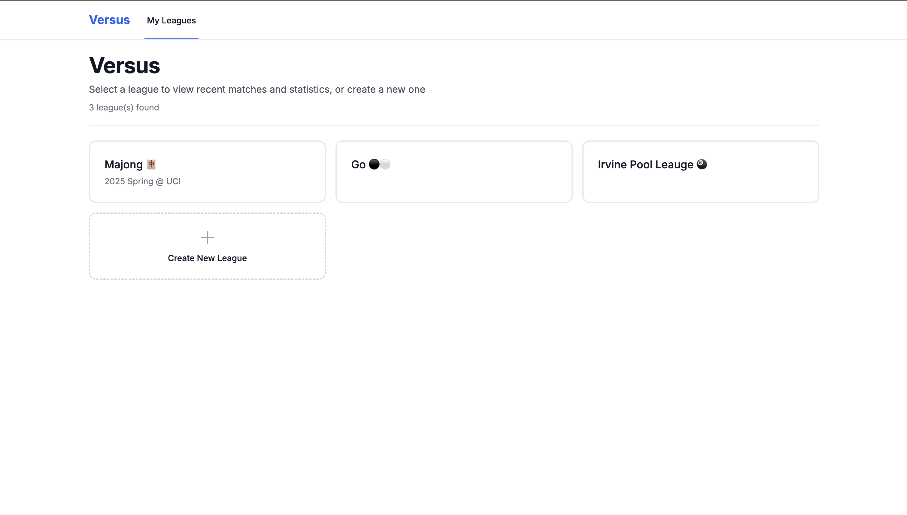
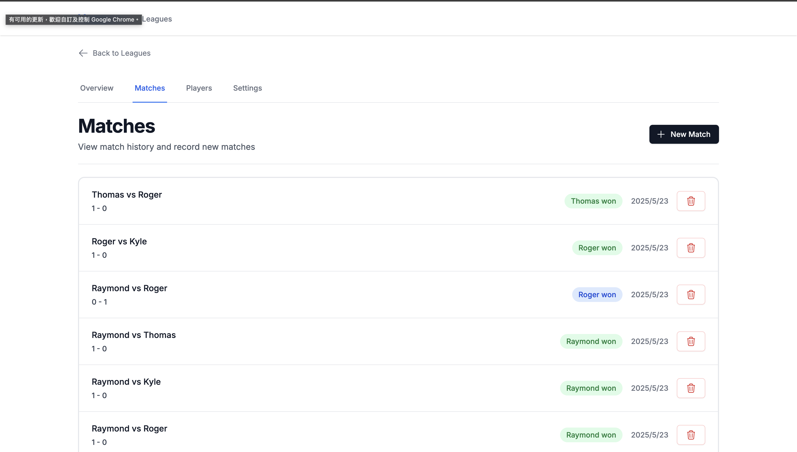
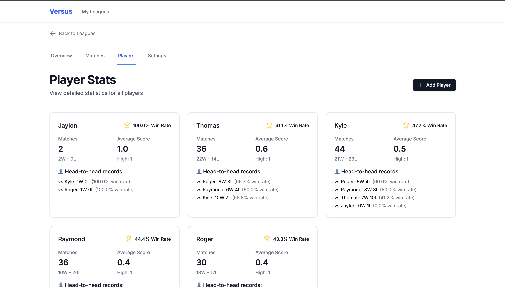
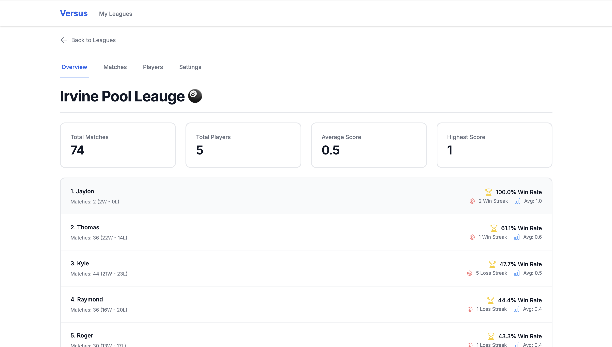

# Versus

[Live Demo](https://versus-one.vercel.app/)

Versus is a competition management platform designed specifically for one-on-one (1:1) games and sports. You can create leagues, record head-to-head matches, and track every player's win rates and performance history. Perfect for board games, sports, and any activity where you want to analyze and celebrate individual competition!

## Features
- Create and manage leagues/competitions
- Record 1:1 matches between players
- Track player statistics, win rates, and head-to-head records
- Responsive UI for desktop and mobile
- Simple, clean interface

## Demo Screenshots

**Home**



**Matches**



**Player Stats**



**Rankings**



## Tech Stack
- Next.js (React, TypeScript)
- Tailwind CSS
- SWR (data fetching)
- Python FastAPI backend
- PostgreSQL

## Getting Started

### Frontend
```bash
cd frontend
npm install
npm run dev
```

### Backend
```bash
cd backend
pip install -r requirements.txt
uvicorn app.main:app --reload
```

## Author
This is a personal side project by Cheng-Yi Tang.

Feel free to fork, use, or contribute! 